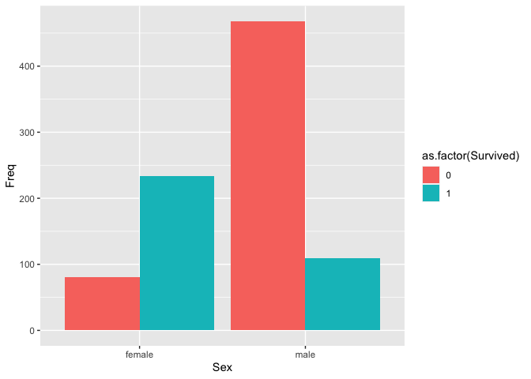
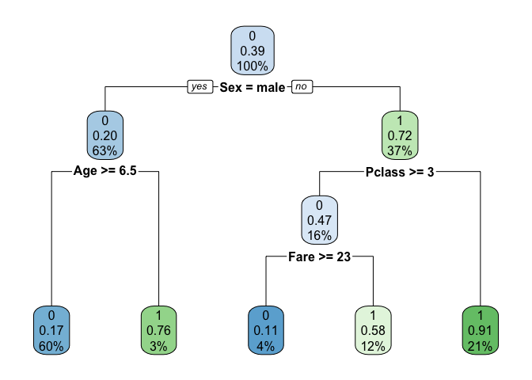

Titanic Prediction: Decision tree
================
Tomoya Ozawa
2022/01/13

## 0\. はじめに

### 0.1. 目的

  - タイタニックの生存者を予測します。

### 0.2. 使用するデータ

  - タイタニック号の搭乗者に関するデータです。1行が搭乗者1名の情報になっています。
  - [こちら](https://www.kaggle.com/c/titanic/data)からダウンロードしてください。
      - `train.csv`:
        生存したかどうかがわかっている搭乗者のデータ。このデータを使って、どんな人が生存している傾向にあるのかをモデルにしていきます。
      - `test.csv`: 今回生存したかどうかを予測したい搭乗者のデータ

### 0.3. 機械学習モデル構築の流れ

1.  データの把握
2.  データの加工
3.  モデル構築
4.  モデルの評価

## 1\. データの把握

  - まずはデータを読み込みます

<!-- end list -->

``` r
df <- read.csv("titanic/train.csv")
```

  - データを確認してみます。今回のタスクは`Survived`が0 or 1かを予測することです。

<!-- end list -->

``` r
head(df)
```

    ##   PassengerId Survived Pclass
    ## 1           1        0      3
    ## 2           2        1      1
    ## 3           3        1      3
    ## 4           4        1      1
    ## 5           5        0      3
    ## 6           6        0      3
    ##                                                  Name    Sex Age SibSp Parch
    ## 1                             Braund, Mr. Owen Harris   male  22     1     0
    ## 2 Cumings, Mrs. John Bradley (Florence Briggs Thayer) female  38     1     0
    ## 3                              Heikkinen, Miss. Laina female  26     0     0
    ## 4        Futrelle, Mrs. Jacques Heath (Lily May Peel) female  35     1     0
    ## 5                            Allen, Mr. William Henry   male  35     0     0
    ## 6                                    Moran, Mr. James   male  NA     0     0
    ##             Ticket    Fare Cabin Embarked
    ## 1        A/5 21171  7.2500              S
    ## 2         PC 17599 71.2833   C85        C
    ## 3 STON/O2. 3101282  7.9250              S
    ## 4           113803 53.1000  C123        S
    ## 5           373450  8.0500              S
    ## 6           330877  8.4583              Q

  - 変数の定義

| 変数          | 定義                            |
| ----------- | ----------------------------- |
| PassengerId | 乗客に紐づけられたID                   |
| Survived    | 生還した人は1, しなかったら0              |
| Pclass      | 旅券の種類, 1: 1st, 2: 2nd, 3: 3rd |
| Name        | 名前                            |
| Sex         | 性別                            |
| Age         | 年齢                            |
| SibSp       | 一緒に乗船した兄弟、配偶者の数               |
| Parch       | 一緒に乗船した両親、子供の数                |
| Ticket      | 旅券の番号                         |
| Fare        | 乗船料金                          |
| Cabin       | 部屋番号                          |
| Embarked    | 乗船した港                         |

  - データの行数と列数を確認します。

<!-- end list -->

``` r
dim(df)
```

    ## [1] 891  12

  - 数値に関しては基本統計量を確認してみます。

<!-- end list -->

``` r
summary(df)
```

    ##   PassengerId       Survived          Pclass          Name          
    ##  Min.   :  1.0   Min.   :0.0000   Min.   :1.000   Length:891        
    ##  1st Qu.:223.5   1st Qu.:0.0000   1st Qu.:2.000   Class :character  
    ##  Median :446.0   Median :0.0000   Median :3.000   Mode  :character  
    ##  Mean   :446.0   Mean   :0.3838   Mean   :2.309                     
    ##  3rd Qu.:668.5   3rd Qu.:1.0000   3rd Qu.:3.000                     
    ##  Max.   :891.0   Max.   :1.0000   Max.   :3.000                     
    ##                                                                     
    ##      Sex                 Age            SibSp           Parch       
    ##  Length:891         Min.   : 0.42   Min.   :0.000   Min.   :0.0000  
    ##  Class :character   1st Qu.:20.12   1st Qu.:0.000   1st Qu.:0.0000  
    ##  Mode  :character   Median :28.00   Median :0.000   Median :0.0000  
    ##                     Mean   :29.70   Mean   :0.523   Mean   :0.3816  
    ##                     3rd Qu.:38.00   3rd Qu.:1.000   3rd Qu.:0.0000  
    ##                     Max.   :80.00   Max.   :8.000   Max.   :6.0000  
    ##                     NA's   :177                                     
    ##     Ticket               Fare           Cabin             Embarked        
    ##  Length:891         Min.   :  0.00   Length:891         Length:891        
    ##  Class :character   1st Qu.:  7.91   Class :character   Class :character  
    ##  Mode  :character   Median : 14.45   Mode  :character   Mode  :character  
    ##                     Mean   : 32.20                                        
    ##                     3rd Qu.: 31.00                                        
    ##                     Max.   :512.33                                        
    ## 

  - カテゴリ変数については、ユニークな値を確認して、それらの頻度をみます。

<!-- end list -->

``` r
df %>% 
  count(Embarked)
```

    ##   Embarked   n
    ## 1            2
    ## 2        C 168
    ## 3        Q  77
    ## 4        S 644

  - どのくらいの人が生存しているのか？どんな人が生存している傾向にあるのかを可視化して確認してみます。

<!-- end list -->

``` r
df %>% 
  count(Survived)
```

    ##   Survived   n
    ## 1        0 549
    ## 2        1 342

  - `train.csv`では38%くらい生存している。

<!-- end list -->

``` r
df_age_survived <- df %>% 
  group_by(Sex, Survived) %>% 
  summarise(Freq = n(), .groups= "drop")
df_age_survived
```

    ## # A tibble: 4 x 3
    ##   Sex    Survived  Freq
    ##   <chr>     <int> <int>
    ## 1 female        0    81
    ## 2 female        1   233
    ## 3 male          0   468
    ## 4 male          1   109

``` r
ggplot(data = df_age_survived, aes(x = Sex, y = Freq, fill = as.factor(Survived))) +
  geom_bar(stat = "identity", position = "dodge")
```

<!-- -->

  - 女性の方が生存している割合が高そうです。

### Groupwork 1

  - 他の変数について確認してみましょう。

## 2\. データの加工

  - `age`列に欠損値がありますね。

<!-- end list -->

``` r
summary(df)
```

    ##   PassengerId       Survived          Pclass          Name          
    ##  Min.   :  1.0   Min.   :0.0000   Min.   :1.000   Length:891        
    ##  1st Qu.:223.5   1st Qu.:0.0000   1st Qu.:2.000   Class :character  
    ##  Median :446.0   Median :0.0000   Median :3.000   Mode  :character  
    ##  Mean   :446.0   Mean   :0.3838   Mean   :2.309                     
    ##  3rd Qu.:668.5   3rd Qu.:1.0000   3rd Qu.:3.000                     
    ##  Max.   :891.0   Max.   :1.0000   Max.   :3.000                     
    ##                                                                     
    ##      Sex                 Age            SibSp           Parch       
    ##  Length:891         Min.   : 0.42   Min.   :0.000   Min.   :0.0000  
    ##  Class :character   1st Qu.:20.12   1st Qu.:0.000   1st Qu.:0.0000  
    ##  Mode  :character   Median :28.00   Median :0.000   Median :0.0000  
    ##                     Mean   :29.70   Mean   :0.523   Mean   :0.3816  
    ##                     3rd Qu.:38.00   3rd Qu.:1.000   3rd Qu.:0.0000  
    ##                     Max.   :80.00   Max.   :8.000   Max.   :6.0000  
    ##                     NA's   :177                                     
    ##     Ticket               Fare           Cabin             Embarked        
    ##  Length:891         Min.   :  0.00   Length:891         Length:891        
    ##  Class :character   1st Qu.:  7.91   Class :character   Class :character  
    ##  Mode  :character   Median : 14.45   Mode  :character   Mode  :character  
    ##                     Mean   : 32.20                                        
    ##                     3rd Qu.: 31.00                                        
    ##                     Max.   :512.33                                        
    ## 

  - 欠損値がある場合は、まずどうして欠損が生じているのか？を考えます。その上で、以下のアプローチを取ることが多いです。
      - 欠損が生じるパターンがあれば、それを考慮してて適切な値を埋める。（例えば、20才未満の人たちはNAになっているとか。）
      - 平均値や中央値で埋める
      - 欠損値の値に推定値を使う
      - 欠損値を含む行を分析に使わない
  - 今回は簡略化のために、欠損を含む行は分析に使わないことにします。

<!-- end list -->

``` r
df <- na.omit(df)
```

  - データを訓練データと検証データに分けます。
      - 訓練データ: モデル構築に使用するデータ
      - 検証データ: モデルの性能を評価するためのデータ

<!-- end list -->

``` r
set.seed(123)
ind_train <- createDataPartition(y = df$Survived, p = 0.7,list = FALSE)
df_train <- df[ind_train,]
df_valid <- df[-ind_train,]
```

## 3\. モデル構築

  - `Pclass`, `Age`, `SibSp`, `Parch`, `Fare`の値を用いて、`Survived`を予測してみます。

<!-- end list -->

``` r
tree <- rpart(Survived ~ Pclass + Sex + Age + SibSp + Parch + Fare , 
              data=df_train, maxdepth=3, method = "class")
```

  - `maxdepth`は木の深さを表します。他にもハイパーパラメータは存在しますが、今回は`maxdepth`をいじってみます。

<!-- end list -->

``` r
rpart.plot(tree)
```

<!-- -->

## 4\. モデルの評価

  - 訓練用データに対するフィット

<!-- end list -->

``` r
df_train$Survived_pred <- predict(tree, df_train, type="class")
```

  - 混同行列

<!-- end list -->

``` r
result_train <- table(df_train$Survived, df_train$Survived_pred)
result_train
```

    ##    
    ##       0   1
    ##   0 264  39
    ##   1  53 144

  - 正解率を計算する

<!-- end list -->

``` r
accuracy_train <- sum(diag(result_train)) / sum(result_train)
accuracy_train
```

    ## [1] 0.816

  - 未知のデータ（検証データ）に対するフィット

<!-- end list -->

``` r
df_valid$Survived_pred <- predict(tree, df_valid, type="class")
```

  - 混同行列

<!-- end list -->

``` r
result_valid <- table(df_valid$Survived, df_valid$Survived_pred)
result_valid
```

    ##    
    ##       0   1
    ##   0 105  16
    ##   1  26  67

  - 正解率を計算する

<!-- end list -->

``` r
accuracy_valid <- sum(diag(result_valid)) / sum(result_valid)
accuracy_valid
```

    ## [1] 0.8037383

  - モデル構築にて、`maxdepth`の値を大きくする（例えば`3` -\>
    `8`にする）と、df\_trainの正解率は向上するが、df\_validの正解率は悪化することを確認することが出来る。この状態を**過学習**と呼ぶ。手元のデータに過剰適合してしまい、本来の目的である未知のデータに対する予測精度が悪化してしまう。

  - 変数の重要度（枝分けにどの程度貢献しているか）を見ると、どの変数が0, 1の分類に重要なのかを把握出来ます。

<!-- end list -->

``` r
tree$variable.importance
```

    ##       Sex       Age      Fare    Pclass     Parch     SibSp 
    ## 62.959790 18.748598 18.173124 17.385953 10.288351  4.316475

### Groupwork2

  - `maxdepth`を8にして、訓練用データと検証用データへのフィットを確認してみましょう

# 5\. おまけ

  - ロジットモデルとの比較

<!-- end list -->

``` r
logit <- glm(Survived ~ Pclass + Sex + Age + SibSp + Parch + Fare, family = binomial(link = "logit"),
             data=df_train)
```

``` r
summary(logit)
```

    ## 
    ## Call:
    ## glm(formula = Survived ~ Pclass + Sex + Age + SibSp + Parch + 
    ##     Fare, family = binomial(link = "logit"), data = df_train)
    ## 
    ## Deviance Residuals: 
    ##     Min       1Q   Median       3Q      Max  
    ## -2.6854  -0.6880  -0.4054   0.6727   2.4117  
    ## 
    ## Coefficients:
    ##              Estimate Std. Error z value Pr(>|z|)    
    ## (Intercept)  5.017481   0.678187   7.398 1.38e-13 ***
    ## Pclass      -1.127004   0.185326  -6.081 1.19e-09 ***
    ## Sexmale     -2.569844   0.254733 -10.088  < 2e-16 ***
    ## Age         -0.043889   0.009346  -4.696 2.66e-06 ***
    ## SibSp       -0.356332   0.147554  -2.415   0.0157 *  
    ## Parch       -0.052648   0.132048  -0.399   0.6901    
    ## Fare         0.001565   0.002478   0.632   0.5277    
    ## ---
    ## Signif. codes:  0 '***' 0.001 '**' 0.01 '*' 0.05 '.' 0.1 ' ' 1
    ## 
    ## (Dispersion parameter for binomial family taken to be 1)
    ## 
    ##     Null deviance: 670.50  on 499  degrees of freedom
    ## Residual deviance: 461.69  on 493  degrees of freedom
    ## AIC: 475.69
    ## 
    ## Number of Fisher Scoring iterations: 4

``` r
df_train$Survived_pred_logit <- predict(logit, df_train, type = "response")
```

``` r
df_train <- df_train %>% mutate(Survived_pred_logit = if_else(Survived_pred_logit > 0.5, "1", "0"))
```

``` r
result_train_logit <- table(df_train$Survived, df_train$Survived_pred_logit)
result_train_logit
```

    ##    
    ##       0   1
    ##   0 259  44
    ##   1  59 138

``` r
accuracy_train_logit <- sum(diag(result_train_logit)) / sum(result_train_logit)
accuracy_train_logit
```

    ## [1] 0.794

  - Kaggleにsubmitする時

<!-- end list -->

``` r
df_test <- read.csv("titanic/test.csv") 
df_test <- df_test %>% 
  replace_na(list(Age = median(df_test$Age, na.rm = TRUE), 
                  Fare = mean(df_test$Fare, na.rm = TRUE)))
```

``` r
# decision tree maxdepth = 3
df_test$Survived <- predict(tree, df_test, type="class")
df_submit <- df_test %>% 
  select(PassengerId, Survived) %>% 
  mutate(Survived = as.numeric(as.character(Survived)))
```

``` r
write.csv(df_submit, "output/submit.csv", row.names = FALSE)
```

``` r
# logit
df_test$Survived <- predict(logit, df_test, type="response")
df_submit_logit <- df_test %>% 
  mutate(Survived = if_else(Survived > 0.5, "1", "0")) %>% 
  select(PassengerId, Survived) %>% 
  mutate(Survived = as.numeric(as.character(Survived)))
```

``` r
write.csv(df_submit_logit, "output/submit_logit.csv", row.names = FALSE)
```
